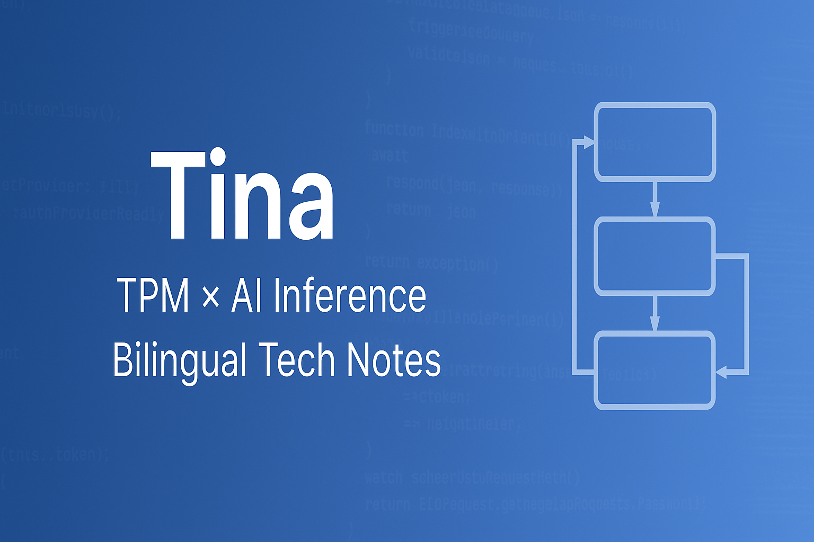

  

# 👋 Hi, I'm Tina

🎯 A Technical Program Manager (TPM) with a NB system development background, currently transitioning into AI infrastructure and inference workflows.

I document and share technical learnings in a bilingual format (English/中文), with a focus on:

- 🔍 **AI Inference**: Triton Server, ONNX Runtime, Transformer-based models  
- 🛠 **TPM Skills**: Cross-functional collaboration, deployment flowcharts, debugging cases  
- 🧠 **Technical Learning**: Git, Linux, IT Support, MLOps, and Generative AI

---

## 🔗 Featured Repository

📂 [`TPM-Technical-Sharing`](https://github.com/tina-net/TPM-Technical-Sharing)  
A curated collection of my self-learning notes on AI systems, architecture diagrams, and TPM deployment workflows.

---

## 📝 Selected Topics

- 🎓 Coursera: *AI Infrastructure and Operations Fundamentals*  
- 🎓 NVIDIA DLI: *Generative AI Explained*  
- 🎓 Google: *Technical Support Fundamentals*

- 💼 BIOS/EC/Validation TPM Debug Notes  
- 📊 AI deployment pipelines & model lifecycle visuals  

---

## 🌐 Let’s Connect

- 🗂 [My Technical Notes on Notion](https://www.notion.so/TPM-Note-1ffe42b98dc680f28989f33d41ccd9eb?pvs=4)  

---

> "I enjoy learning. I enjoy picking up new tools that help me collaborate better with engineers."

